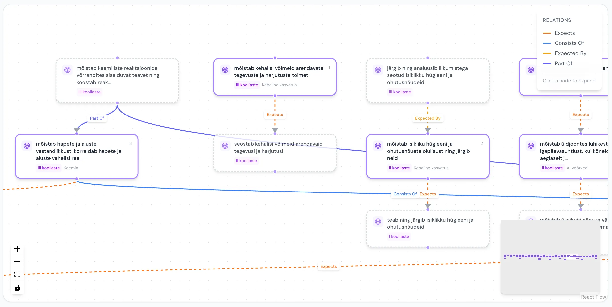

Laravel
React
PHP
EasyRdf
React Flow

# RDF Curriculum Manager

A platform for managing and publishing Estonian national curriculum data in machine-readable RDF and JSON-LD formats. Enables semantic relationships between learning outcomes, interactive graph visualization, and linked data export for interoperability with e-learning platforms.

<a href="https://cm.h5p.ee" class="lab-detail-link">cm.h5p.ee</a>

// 01

## Overview

The Curriculum Manager transforms the Estonian national curriculum into a structured, machine-readable knowledge graph. Curriculum editors define subjects, hierarchical topics, learning outcomes, and granular skill-bits, while the system maintains semantic relationships (prerequisites, compositions) between outcomes including cross-subject dependencies. The entire dataset is exportable as RDF Turtle, JSON-LD, or plain JSON for consumption by external platforms.

### Key Capabilities

- **Semantic Curriculum Graph** — define `expects` (prerequisite) and `consistsOf` (composition) relationships between learning outcomes, visualized as an interactive node graph with click-to-expand exploration
- **Linked Data Export** — RDF Turtle, JSON-LD, and plain JSON formats for interoperability with e-learning platforms and semantic web tools
- **Skill-Bits** — granular sub-components of learning outcomes with inline management directly within the outcomes view
- **Hierarchical Structures** — deeply nested topics and outcomes with optional grade metadata and course-level gymnasium topics
- **REST API** — token-authenticated endpoints for subjects, topics, outcomes, skill-bits, and bulk exports
- **Data Import** — bulk curriculum import from structured JSON datasets via web UI or command line

// 02

## Technical Architecture

Backend

Laravel, PHP, MySQL

Frontend

React, Inertia.js, Tailwind CSS

Graph Visualization

React Flow — interactive node graph for outcome relationships

Semantic Layer

EasyRdf — RDF graph generation (Turtle, JSON-LD)

API Auth

Laravel Sanctum (Bearer tokens)

### Core Services

| Service | Responsibility |
|---------|----------------|
| `CurriculumRdfBuilder` | Generates RDF Turtle graphs from curriculum data |
| `CurriculumJsonLdBuilder` | Generates JSON-LD linked data representations |
| `CurriculumImportService` | Bulk import from structured JSON datasets |

// 03

## Semantic Data Model

The curriculum is organized as a hierarchical graph with semantic relationships:

- **Subjects** → **Topics** → **Learning Outcomes** → **Skill-Bits**
- Topics carry optional `grade` metadata (1–12) and gymnasium topics use `type: "course"` (exported as `curriculum:Course` in RDF/JSON-LD)
- Learning outcomes are connected by two relationship types:
    - **`expects`** — prerequisite chains (within-subject progressions and cross-subject dependencies, e.g. Physics → Mathematics)
    - **`consistsOf`** — composition relationships linking outcomes to their constituent parts

### Dataset Scale

The system manages the full Estonian national curriculum:

| Entity | Count |
|--------|-------|
| Subjects | 39 |
| Topics | 420 |
| Learning Outcomes | 2,632 |
| Skill-Bits | 10,391 |
| Outcome Relations | 875 (849 expects + 26 consistsOf, including 153 cross-subject) |

Coverage spans I–III kooliaste (grades 1–9) using 2023 national curriculum data and legacy data from oppekava.edu.ee, plus gymnasium level with 91 courses across 26 subjects based on the 2023 gymnasium curriculum.

// 04

## Linked Data & Interoperability

The platform exports curriculum data in three formats for consumption by external systems:

**RDF (Turtle)** — full semantic web format with typed resources, enabling SPARQL queries and integration with other linked data sources.

**JSON-LD** — lightweight linked data format designed for web APIs, embedding semantic context within standard JSON structures.

**Plain JSON** — complete tree export for platforms that need structured data without semantic overhead.

All exports are available per-subject or as bulk operations through the REST API. The API follows a cascading selector pattern: subjects → topics → outcomes → skill-bits, documented in a built-in integration guide with code examples in JavaScript, Python, and cURL.

// 05

## Relation Generation

Outcome relations (prerequisite chains and compositions) were generated using Claude API via a dedicated script, covering:

- Within-subject progressions across grade levels
- Cross-subject dependencies (e.g., physics prerequisites from mathematics)
- Recovered legacy relations from previous curriculum versions

The generated relations are stored as structured JSON and imported alongside the curriculum data using deterministic UUIDs, making re-import safe and idempotent.

// 07

## Related Services

- **Live API**: [cm.h5p.ee](https://cm.h5p.ee/)
- **API Documentation**: [Integration Guide](https://cm.h5p.ee/integration-guide)
