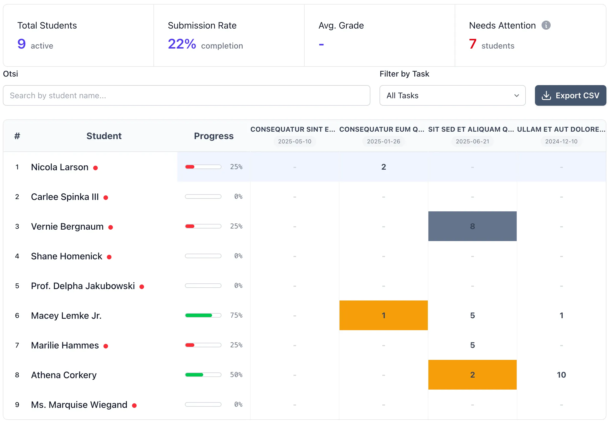

Laravel
Vue / TypeScript
Inertia.js
DaisyUI

# eDidaktikum

A competency-based learning platform built on Estonian national occupational qualification standards. Supports educators, trainers, and learners in developing, evidencing, and assessing competencies through groups, tasks, discussions, and e-portfolios — with DigCompEdu mapping for digital competence.

<a href="https://edidaktikum.ee" class="lab-detail-link">edidaktikum.ee</a>

// 01

## Overview

eDidaktikum is a platform where teaching meets technology. It enables competency-based learning by linking courses, tasks, and assessments to national occupational qualification standards maintained by Kutsekoda (Estonian Qualifications Authority). Whether running a university seminar, leading a research group, or training gardeners — the platform adapts to diverse educational workflows.

eDidaktikum is not an official competency certification tool. It is an independent service that supports various stakeholders in the competency development process.

### Key Capabilities

- **Competency-based learning** — design courses around learning outcomes and competencies, link tasks to specific skills, and track learner development over time
- **Task management and feedback** — create and assign tasks aligned to competencies, collect learner work, and provide substantive feedback to support development
- **Collaborative discussions** — foster academic discourse with integrated discussions, reactions, and peer feedback within learning groups
- **Competency-based portfolios** — learners build portfolios aligned with occupational standards and the DigCompEdu framework, tracking competency acquisition through self-assessment and evidence linking
- **Progress and analytics** — monitor student engagement with detailed analytics, identify who needs support, and track progress in real-time
- **Flexible learning groups** — public or private groups for organizing courses, seminars, or research group work

// 02

## Technical Architecture

Backend

Laravel, PHP

Frontend

Vue (Composition API, script setup), TypeScript, Inertia.js

Styling

Tailwind CSS, DaisyUI

Database

MySQL

Search

Meilisearch

Auth

Laravel Breeze, HarID integration (Estonian national identity)

Testing

PHPUnit (feature/unit), Laravel Dusk (browser), Larastan (static analysis)

Deployment

Laravel Sail (local), production server

// 03

## Competency Standards Integration

The platform imports occupational qualification standards from the Estonian national competency XML file maintained by Kutsekoda. Standards are organized in a three-level hierarchy:

**Standard → Competence → Performance Indicator**

Educator standards (containing "Õpetaja", "Vanemõpetaja", or "Meisterõpetaja") are automatically identified and support DigCompEdu mapping for digital competence assessment.

### Data Flow

- **Initial import** — the full XML file is parsed and imported, creating the three-level hierarchy in the database
- **Non-destructive sync** — when national standards are updated, a sync process adds new standards, archives removed ones (preserving existing group/task associations), and reactivates standards that reappear
- **Admin management** — administrators can edit standards, map performance indicators to DigCompEdu areas and competences, and reactivate archived standards

This design ensures that curriculum changes at the national level propagate into the platform without disrupting existing courses or learner portfolios.

// 04

## Competency-Based Portfolios

Learners build e-portfolios aligned with occupational standards and the DigCompEdu framework. The portfolio system connects three elements:

- **Self-assessment** — learners evaluate their own competency level against standard performance indicators
- **Evidence linking** — completed tasks and artifacts are linked to specific competencies as evidence of achievement
- **Progress tracking** — both learners and educators can monitor competency acquisition over time, identifying gaps and strengths

For educator standards specifically, performance indicators can be mapped to DigCompEdu areas and competences, enabling digital competence assessment within the broader occupational qualification framework.

// 05

## Groups, Tasks, and Feedback

The platform is structured around learning groups — flexible containers that can represent a university course, a seminar series, a research group, or a professional training cohort.

Within groups, educators:

- **Create tasks** aligned to specific competencies and performance indicators
- **Collect learner submissions** — written work, files, and other artifacts
- **Provide feedback** tied to competency criteria, supporting formative assessment
- **Facilitate discussions** with threaded conversations, reactions, and peer feedback

Progress analytics give educators a real-time view of engagement and achievement across their groups, helping them identify learners who need support.

// 06

## Authentication and Registration Protection

The platform supports two authentication paths:

- **HarID** — Estonian national identity authentication for institutional users
- **Local registration** — email/password accounts with built-in anti-bot protection (rate limiting, honeypot validation, minimum submit time, email verification) — no third-party captcha required

Legacy users created before email verification was enabled are handled via a configurable cutoff date, exempting them from verification unless they change their email address.

