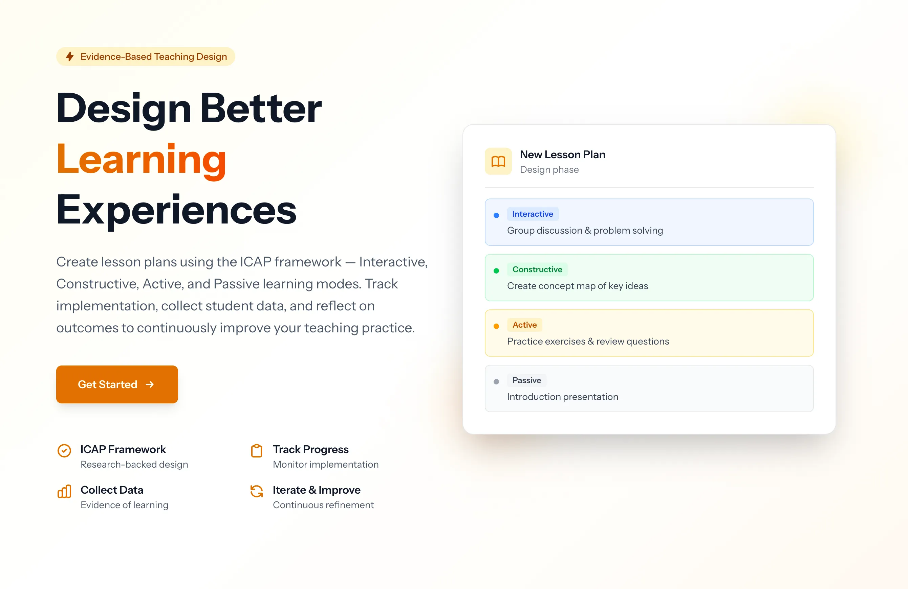

Laravel
PHP
Filament
MariaDB

# ICAP Lesson Plan Toolbox

A lesson planning tool for teachers to design, implement, and reflect on lessons using the ICAP (Interactive, Constructive, Active, Passive) framework. Supports iterative lesson improvement, implementation tracking, student data collection, and structured teacher reflection with a mentor system.

<a href="https://icap.h5p.ee" class="lab-detail-link">icap.h5p.ee</a>

// 01

## Overview

The ICAP Lesson Plan Toolbox helps teachers structure their lessons around Chi & Wylie's ICAP framework, which categorizes learning activities by cognitive engagement level. Teachers design lesson plans with tasks mapped to ICAP levels, track classroom implementation, collect student data, and reflect using a structured perceive–interpret–decide cycle. A mentor system allows experienced educators to review and guide lesson design.

### Key Capabilities

- **ICAP-structured lesson design** — organize tasks by cognitive engagement level (Passive, Active, Constructive, Interactive) with tools, feedback types, and transitions
- **Lesson iterations** — track revisions for continuous improvement across teaching cycles
- **Implementation tracking** — log actual classroom events, unexpected behaviors, technical issues, and observed dominant ICAP levels
- **Student data collection** — self-reports, reflections, observations, photos, and activity logs
- **Structured reflection** — perceive (what happened), interpret (why), decide (what to change)
- **Mentor system** — assign mentors to teachers with dashboard visibility into assigned teachers' lessons
- **Sharing** — share lessons via secure, unique tokens

// 02

## Technical Architecture

Backend

Laravel, PHP

Admin Panel

Filament with Shield (role/permission management)

Permissions

Spatie Laravel Permission

Database

MariaDB

License

Proprietary — Centre for Educational Technology, Tallinn University

// 03

## The ICAP Framework

The tool is built around the ICAP framework (Chi & Wylie, 2014), which predicts that learning outcomes improve as cognitive engagement increases through four levels:

| Level | Engagement | Example Activities |
|-------|-----------|-------------------|
| **Interactive** | Co-generative — learners build on each other's contributions | Debate, collaborative problem-solving, peer teaching |
| **Constructive** | Generative — learners produce outputs beyond what was given | Concept mapping, self-explanation, hypothesis generation |
| **Active** | Manipulative — learners engage with materials physically or attentionally | Note-taking, highlighting, copying solutions |
| **Passive** | Receptive — learners receive information without overt action | Listening to lectures, reading without annotation |

The ICAP hypothesis: **Interactive > Constructive > Active > Passive** in terms of learning outcomes. The toolbox helps teachers consciously design lessons that move students toward higher engagement levels.

// 04

## Quality Checkpoints

The system includes built-in quality checks for lesson plans:

- **Measurable learning outcomes** — are outcomes specific and assessable?
- **Clear cognitive activities** — is each task mapped to an appropriate ICAP level?
- **Explanation and collaborative tasks** — does the lesson include constructive and interactive elements?
- **Connected to discussion** — are tasks linked to meaningful discourse?
- **Feedback supports thinking** — does feedback push toward higher ICAP levels?

These checkpoints guide teachers toward well-structured lessons that maximize cognitive engagement.

// 05

## Reflection Cycle

After classroom implementation, teachers engage in a structured reflection process:

**Perceive** — what actually happened? Teachers log observed events, student behaviors, technical issues, and the dominant ICAP levels they witnessed during the lesson.

**Interpret** — why did it happen? Teachers analyze gaps between planned and actual engagement levels, identify what worked and what didn't, and consider contextual factors.

**Decide** — what will I do differently? Teachers document specific changes for the next iteration, creating a traceable improvement history across lesson versions.

This cycle, combined with student data (self-reports, observations, activity logs), creates an evidence base for iterative lesson refinement.

// 06

## Mentor System

The mentor system supports professional development by pairing experienced educators with teachers:

- Admins assign mentor–teacher relationships
- Mentors see a dashboard widget with their assigned teachers' lessons
- Mentors can review lesson designs, implementation logs, and reflections
- Role-based access ensures mentors only see their own assigned teachers

