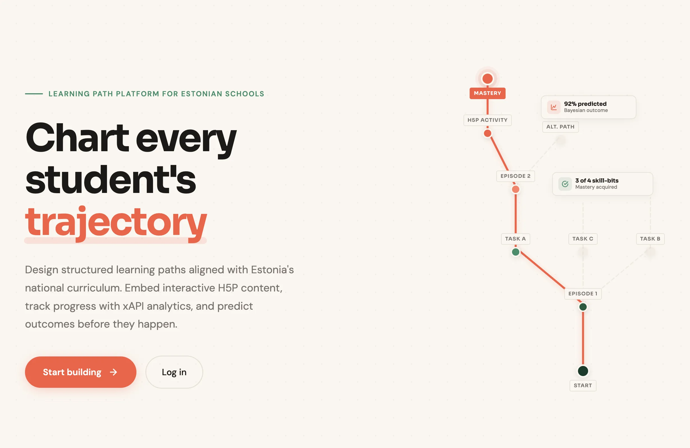

<div class="lab-detail-header" markdown>

<div class="lab-detail-badges" markdown>
<span class="lab-badge lab-badge--stack">Laravel</span>
<span class="lab-badge lab-badge--stack">PHP</span>
<span class="lab-badge lab-badge--stack">Filament</span>
<span class="lab-badge lab-badge--stack">Tailwind CSS</span>
<span class="lab-badge lab-badge--stack">MySQL</span>
</div>

# Trajectory Builder

<div class="lab-detail-desc">
A learning trajectory application for creating and managing educational learning paths with episodes, tasks, student progress tracking, xAPI learning analytics, and Estonian national curriculum integration.
</div>

<a href="https://trajektoor.ee" class="lab-detail-link">trajektoor.ee</a>

</div>

<span class="lab-section-num">// 01</span>

## Overview

Trajectory Builder enables teachers to create structured learning paths — trajectories composed of episodes and tasks — and deploy them as sessions that students enroll in via registration codes. The platform captures granular learning analytics through xAPI integration with H5P content, provides Bayesian prediction of learning outcomes, and connects all content to the Estonian national curriculum via cascading skill-bit mappings.



### Key Capabilities

- **Instructional Trajectory Management** — hierarchical content organization with visual flow diagrams (Mermaid.js)
- **H5P Integration** — search and embed interactive content from vara.h5p.ee
- **xAPI Learning Analytics** — automatic capture and storage of learning statements from H5P interactions
- **xAPI-Gated Completion** — resource completion gated by actual H5P performance, with smart fallbacks
- **Bayesian Outcome Prediction** — success probability calculated from five weighted factors
- **Curriculum Integration** — Estonian national curriculum via [Curriculum API](https://cm.h5p.ee/) with cascading dropdowns and prerequisite hints
- **Role-Based Interfaces** — separate teacher analytics dashboards and student progress views

<span class="lab-section-num">// 02</span>

## Technical Architecture

<div class="lab-specs" markdown>
<div class="lab-spec-row" markdown>
<div class="lab-spec-key">Framework</div>
<div class="lab-spec-val">Laravel, PHP</div>
</div>
<div class="lab-spec-row" markdown>
<div class="lab-spec-key">Admin Panel</div>
<div class="lab-spec-val">Filament</div>
</div>
<div class="lab-spec-row" markdown>
<div class="lab-spec-key">Auth</div>
<div class="lab-spec-val">Laravel Breeze</div>
</div>
<div class="lab-spec-row" markdown>
<div class="lab-spec-key">Database</div>
<div class="lab-spec-val">MySQL (DDEV local / Ploi.io production)</div>
</div>
<div class="lab-spec-row" markdown>
<div class="lab-spec-key">Media</div>
<div class="lab-spec-val">Spatie Media Library</div>
</div>
<div class="lab-spec-row" markdown>
<div class="lab-spec-key">Styling</div>
<div class="lab-spec-val">Tailwind CSS — custom earthy/cartographic theme with Sora + DM Sans typography</div>
</div>
<div class="lab-spec-row" markdown>
<div class="lab-spec-key">Interoperability</div>
<div class="lab-spec-val">xAPI statements, LTI-compatible H5P embedding</div>
</div>
<div class="lab-spec-row" markdown>
<div class="lab-spec-key">Deployment</div>
<div class="lab-spec-val">Ploi.io (production), DDEV (local development)</div>
</div>
<div class="lab-spec-row" markdown>
<div class="lab-spec-key">License</div>
<div class="lab-spec-val">MIT</div>
</div>
</div>

### Service Architecture

The application is organized around specialized service classes:

| Service | Responsibility |
|---------|----------------|
| `StudentProgressService` | Progress calculation, time analytics, xAPI metrics |
| `TeacherInsightsService` | Session overview, heatmaps, at-risk detection |
| `SuggestionEngine` | Personalized recommendations (Estonian language) |
| `LearningOutcomePredictionService` | Bayesian probability predictions |
| `ResourceCompletionService` | xAPI-gated completion eligibility with fallback logic |
| `CurriculumApiService` | Communication with Curriculum Tool API, local caching |

<span class="lab-section-num">// 03</span>

## xAPI Learning Analytics

When students interact with embedded H5P materials, xAPI statements are captured automatically via `postMessage` (origin-validated), stored with full context, and used to gate resource completion and power analytics dashboards.

### xAPI-Gated Completion

For embedded H5P resources, the "Mark as Complete" button is disabled until xAPI interaction is detected. Smart defaults require no teacher configuration:

- **Embedded H5P resources** — require xAPI interaction before completion
- **Non-embeddable H5P / plain resources** — manual completion
- **Detection window** — auto-enables after 60 seconds if H5P content type doesn't emit xAPI
- **Extended fallback** — 5-minute fallback for cases where xAPI was detected but completion criteria weren't fully met

Teachers can override per-resource: auto-detect (default), manual, xAPI interaction, xAPI completion, or minimum score threshold.

### Data Captured

| Field | Description |
|-------|-------------|
| `verb_display` | Action performed (completed, answered, interacted) |
| `object_id` | H5P content identifier |
| `result_parsed` | Scores, success, completion status |
| `resource_id` | Link to specific learning resource |
| `learning_session_id` | Link to student's enrolled session |

Data is retained for 90 days, then automatically cleaned up.

<span class="lab-section-num">// 04</span>

## Curriculum Integration

The application integrates with the Estonian national curriculum via the [Curriculum Tool API](https://cm.h5p.ee/). Curriculum data is fetched live and cached locally in the database.

### Data Structure

- **School Levels** → **Subjects** → **Topics** → **Subtopics** (optional)
- **Topics/Subtopics** have **Learning Outcomes**
- **Learning Outcomes** have **Skill-bits** (selectable for Episodes)
- **Learning Outcomes** can have **Prerequisites** (warning hints)

Curriculum dropdowns cascade top-to-bottom: school level filters subjects (API-side), topics are filtered client-side to only show those with outcomes for the selected school level (cached 1hr), and outcomes are filtered by both topic and school level.

<span class="lab-section-num">// 05</span>

## Bayesian Prediction Model

The system calculates success probability for learning outcomes using five weighted factors:

| Factor | Weight | Description |
|--------|--------|-------------|
| Skill-bit mastery | 35% | Progress on associated micro-skills |
| xAPI performance | 25% | H5P interaction scores |
| Task completion | 15% | Completed vs total tasks |
| Prerequisites | 15% | Mastery of required prior knowledge |
| Time patterns | 10% | Appropriate time spent (not rushing/struggling) |

Predictions update automatically when tasks are completed or xAPI statements are received.

<span class="lab-section-num">// 06</span>

## Student & Teacher Interfaces

### Student Dashboard

Progress view with overall completion percentage, episode-by-episode breakdown, skill-bit mastery grid, xAPI performance metrics, Bayesian predictions per learning outcome, personalized suggestions in Estonian, and quality badges showing best score and attempt count.

### Teacher Dashboard

Session analytics with enrolled/active/at-risk student counts, progress heatmap (student × task matrix), at-risk student alerts with risk factors, task difficulty analysis, time estimation accuracy, skill-bit coverage rates, CSV data export, and individual student detail pages.

<span class="lab-section-num">// 07</span>

## API Endpoints

### xAPI Receiver
```
POST /student/xapi
```

### Student Analytics
```
GET /student/session/{id}/progress
GET /student/session/{id}/skill-bits
GET /student/session/{id}/suggestions
GET /student/resources/{id}/completion-status?learning_session_id=X
```

### Teacher Analytics
```
GET /teacher/session/{id}/analytics
GET /teacher/session/{id}/student/{user}
GET /teacher/session/{id}/export/csv
GET /teacher/session/{id}/heatmap-data
```

### H5P Search
```
GET /api/h5p/search?q={query}
```

<span class="lab-section-num">// 08</span>

## Data Privacy

- xAPI data retained for **90 days** maximum
- Teachers see only their own sessions' data
- Students see only their own progress
- GDPR-compliant data handling

<span class="lab-section-num">// 10</span>

## Related Services

- **Curriculum API**: [cm.h5p.ee](https://cm.h5p.ee/)
- **H5P Content**: [vara.h5p.ee](https://vara.h5p.ee/)
